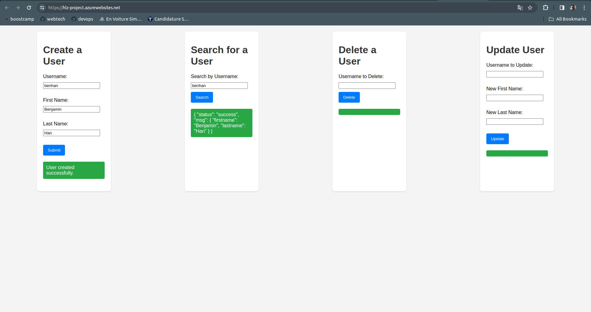
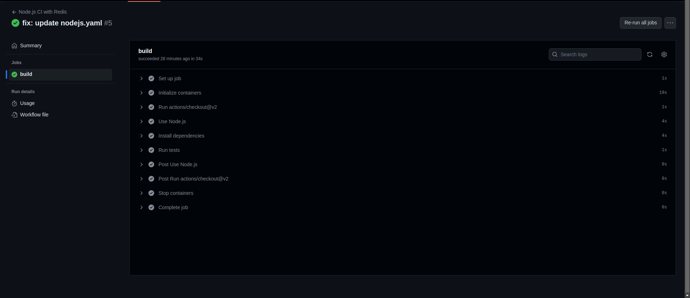
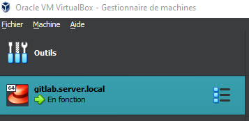
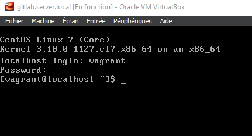
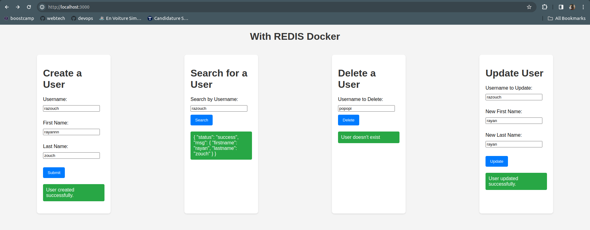
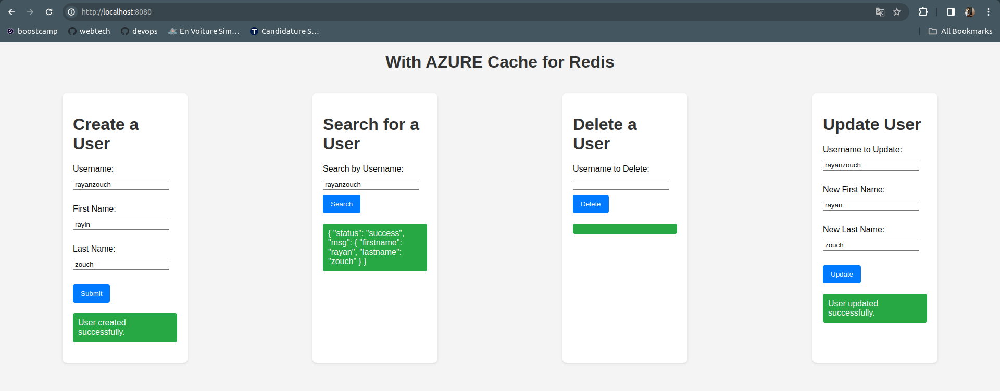
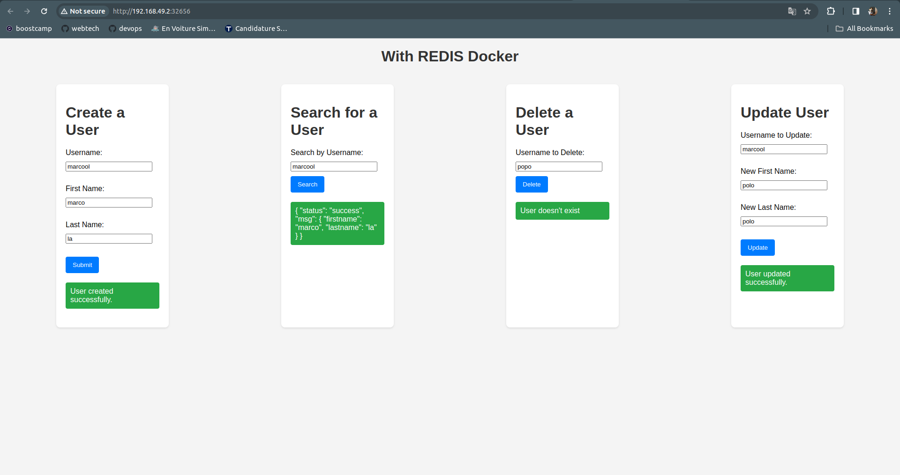
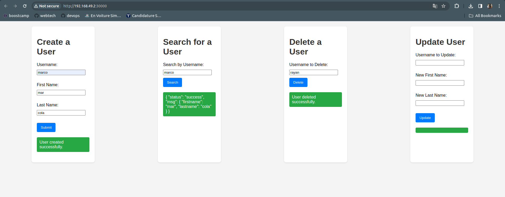
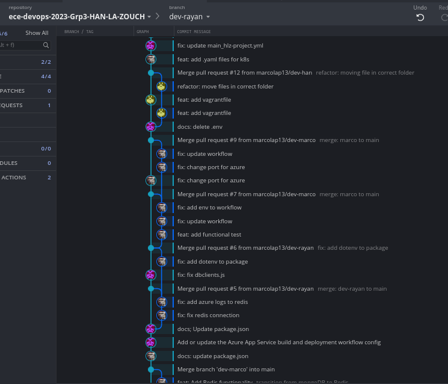

# ECE DevOps 2023 - Group 3 (HAN, LA, ZOUCH)

## Description

This repository showcases the work and projects completed by Group 3 for the DevOps course in our ING4 year at ECE. It includes a range of labs and a comprehensive end-of-year project that involves developing a web application using a specific programming language, implementing a database for data storage, and ensuring quality through multiple testing levels.

Access our project website deployed on Microsoft Azure: [HLZ Project](https://hlz-project.azurewebsites.net/).

## Features

- **Programming Language:** Node.js
- **Database:** Redis
- **Functionality:** CRUD operations for user management
- **Test Levels:** Unit, API, Configuration, Connection

## Installation

Clone the repository and navigate to its directory:
```bash
git clone https://github.com/marcolap13/ece-devops-2023-Grp3-HAN-LA-ZOUCH.git

```


## Usage

To get the project up and running, follow these steps:

First, navigate to the project (userapi) directory:
```bash
cd userapi
```

1. **Install Dependencies:**

```bash
npm install

```

2. **Start Redis docker:**


To run Redis locally using Docker, open a new terminal and execute the following command:
```bash
docker run -p 6379:6379 --name my-redis redis
```


3. **Start the Application:**


To launch the application locally:
```bash
npm start
```

3. **Running Tests:**

To test the functionality of the site (e.g., database connections, etc.):
```bash
npm test
```
4. **Access the application:**

After doing these command you can go to the url : http://localhost:3000

### Bonus Method !

If you want to use Azure Cache for Redis instead of a local Redis instance, navigate to the **userapi_with_REDIS_AZURE** directory (don't forget to stop redis docker first !):
```bash
cd userapi_with_REDIS_AZURE
```
1. **Install Dependencies:**

```bash
npm install

```

2. **Start the Application:**


Then, start the application::
```bash
npm start
```

3. **Access the application:**

After doing these command you can go to the url : http://localhost:8080

## CI/CD using Azure

We have successfully configured and applied CI/CD using Azure DevOps for our project.

### Pipeline Configuration

Our CI/CD pipeline includes the following steps:

1. **Build:**
   - Compilation and packaging of the application, with npm install, build and test

2. **Deploy to Azure Web App:**
   - Deploying the application to an Azure Web App.
The application is deployed at https://hlz-project.azurewebsites.net/. 



Azure Redis is utilized, and sensitive information such as .env files are stored securely in the GitHub secret environment.

### Continuous integration for Redis in docker

Moreover, we ensure continuous integration for our Node.js application with a Redis Docker environment.


  
## Infrastructure as Code (IaC) Configuration with Vagrant and Ansible

Before Getting Started ensure that you have VirtualBox and Vagrant installed on your machine.
If you are using Windows, make sure that Hyper-V is disabled.

### Configure and Provision a Virtual Environment

Virtual Environment Setup: Configuring a CentOS 7 VM using Vagrant.
Create a `Vagrantfile` to define the VM configuration.

Use Vagrant Commands: 
```bash
vagrant up

vagrant halt

vagrant destroy

vagrant status

vagrant ssh
```



SSH Connection: Accessing the VM via vagrant ssh to execute Linux commands



### Provision the VM with Ansible

Installation Testing: Accessing GitLab via http://localhost:8080/ (You can also use other port by modifying it in the Vagrantfile).
Managing Ansible Playbooks: Editing and executing playbooks for GitLab configuration.

Setting up a Health Check for GitLab
Running Health Checks: Utilizing curl and Ansible to verify the health status of GitLab.
Displaying Results: Showing the results of health checks in the console.

Detailed instructions are provided for setting up and managing virtual environments and GitLab installations.
This project section demonstrates the use of imperative and declarative techniques for infrastructure management with IaC.


## Build Docker image

Docker is a platform for containerization, enabling applications to be packaged with their dependencies in isolated, portable containers. 
It streamlines development and deployment while ensuring consistency and efficiency.

### Prerequisites

Before getting started verify that you have docker desktop installed on your machine.
And make sure your docker installation is working properly by running the folowwing command in a terminal:
```bash
docker run hello-world
```

### Usage

To containerize our application, we need to run two Docker containers: one for **Redis** and another for the **application**.

0. **Create Docker Network**

Before running the containers, create a Docker network to facilitate communication between them:

```bash
docker network create mynetwork
```

1. **Run Redis Docker Container**

Firstly, run the Redis Docker container using the following command:

```bash
docker run -p 6379:6379 --name mon-redis --network mynetwork redis:latest
```

2. **Pull Application Docker Image**

Next, pull the Docker image for our application from Docker Hub:


```bash
docker pull marcolap13/userapi_redis:latest
```

3. **Run Application Docker Container**

Now, launch the Docker container for our application:

```bash
docker run -p 3000:3000 --name mon-app --network host marcolap13/userapi_redis:latest

```

4. **Access the application:**

After completing these steps, you can access the application at http://localhost:3000.


#### **Note:**

If you encounter issues with ports already in use, you can stop and remove all containers using the following commands:

```bash
docker stop $(docker ps -q)
docker rm -f $(docker ps -aq)
```

### Bonus Method !

We have also implemented the bonus method using Redis on Azure. Follow these steps:

1. **Pull Redis Azure Application Docker Image**

Pull the Docker image for the application with Redis on Azure:

```bash
docker pull bensaebe/redis_azu_app
```

2. **Run Redis Azure Application Docker Container**

Run the Docker container for the application with Redis on Azure:

```bash
docker run -p 12345:3000 -d bensaebe/redis_azu_app
```


Note: The simple Dockerfile may not connect to the Azure Redis database as it does not include the .env file. This is addressed in the Docker Compose implementation.


## Make container orchestration using Docker Compose

Docker Compose is a tool that simplifies the orchestration of multi-container Docker applications through a single configuration file, enabling easy development and testing of complex setups.

### Prerequisites

If last part was done you already have docker desktop !

### Usage

First, navigate to the project (userapi) directory:
```bash
cd userapi
```

Then you can build the docker and run it
```bash
docker-compose build
docker-compose run
# or
docker-compose up
```


You can see the application on the website : https://localhost:3000




### Bonus Method !

We have also implemented the bonus method using Redis on Azure. Follow these steps:

First, navigate to the project (userapi) directory:
```bash
cd userapi_with_REDIS_AZURE
```

Then you can build the docker and run it
```bash
docker-compose build
docker-compose run
# or
docker-compose up
```
You can see the application on the website : https://localhost:8080




## Kubernetes Setup Guide with Minikube

This guide explains how to install and run a local Kubernetes cluster using Minikube.

Note: We use Secret.yaml to securely manage sensitive information since we are connected to REDIS_AZURE. This file contains important data from the .env file, eliminating the need for using persistent volumes (pv) and persistent volume claims (pvc) as we are not using Redis locally.


### Prerequisites

- [Minikube](https://minikube.sigs.k8s.io/docs/start/) must be installed on your machine.

- [kubectl](https://kubernetes.io/docs/tasks/tools/install-kubectl/) must be installed to interact with the Kubernetes cluster.

### Steps

1. Start Minikube (with the docker driver to avoid errors)
```bash
minikube  start --driver=docker
```

2. You can check Minikube status with
```bash
minikube  status
```

3. Deploy an application on Kubernetes, (use the provided YAML files to deploy an application, e.g., Deployment.yaml, Service.yaml, persistent-volume-claim.yaml, persistent-volume.yaml.)

```bash
kubectl  apply  -f  k8s/
```

4. Wait that the pods is running with:
```bash
kubectl  get  pods
```

you can check all the status with:
```bash
kubectl  get  deployments

kubectl  get  pods

kubectl  get  services
```

5. Access the application (get the URL to access the application with)
```bash
minikube  service  hlz-app-service  --url
# or access to the application directly with
minikube  service  hlz-app-service 
```




6. Stop Minikube
```bash
minikube  stop
```


### Bonus Method !

We have also implemented the bonus method using **Redis on Azure**. Follow these steps, (first you can restart with **minikube delete** after **minikube stop**:

1. Start Minikube (with the docker driver to avoid errors)
```bash
minikube  start --driver=docker
```

2. You can check Minikube status with
```bash
minikube  status
```

3. Deploy an application on Kubernetes, (use the provided YAML files to deploy an application, e.g., Deployment.yaml, Service.yaml, Secret.yaml, Service.yaml.)

*(Secrets in Kubernetes are used to store and manage sensitive information, such as passwords, tokens, and keys.)*

```bash
kubectl  apply  -f  k8s_with_REDIS_AZURE/
```

4. Wait that the pods is running with:
```bash
kubectl  get  pods
```

you can check all the status with:
```bash
kubectl  get  deployments

kubectl  get  pods

kubectl  get  services
```

5. Access the application (get the URL to access the application with)
```bash
minikube  service  my-app-service  --url
# or access to the application directly with
minikube  service  my-app-service 
```




6. Stop Minikube
```bash
minikube  stop
```

note: It's noteworthy that with Kubernetes (K8s) or Docker Compose using this method (redis with azure) , the databases are connected, allowing access to the same database. This ensures consistent data access and management across the deployed services. You can then attempt to create a user using Docker Compose and subsequently search for that user using Kubernetes.


## Additional info

We have integrated **GitKraken** into our workflow, utilizing its powerful features to enhance collaboration and streamline version control. GitKraken has proven to be an invaluable tool for us, all along the project !




## Authors

-  Benjamin  HAN

-  Marco  LA

-  Rayan  ZOUCH